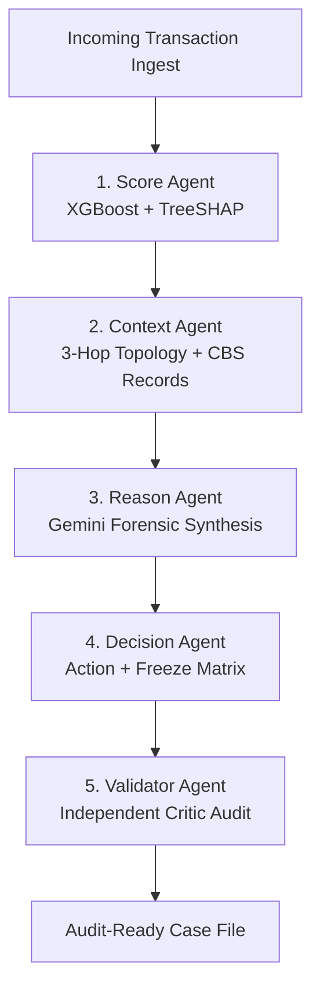

# SafeFlow: Autonomous Financial Crime Investigation & Insider-Risk Intelligence Platform

<div align="center">


**Real-time transaction surveillance, multi-agent AI investigation, and regulatory compliance — unified with employee insider-risk correlation — for modern banks, payment gateways, and compliance teams.**

[](https://smarthorizon.onrender.com)
[](https://ledger-sigma-gules.vercel.app)
[](https://python.org)
[](#-detection-accuracy--false-positive-validation)
[](#%EF%B8%8F-statutory--regulatory-alignment)

</div>

---

<<<<<<< HEAD
---
=======
## ⚡ The Problem

Financial institutions process billions of transactions daily, yet AML and Fraud Risk operations remain crippled by four structural failures:

1. **The false-positive crisis.** Over 95% of rule-based AML alerts are false positives, burning thousands of analyst hours a week.
2. **The ₹50,000 structuring loophole.** PMLA 2002 §12 mandates reporting transfers above ₹50,000 — so crime syndicates split illicit funds into ₹48,500 / ₹49,500 tranches through mule networks that no single-transaction model can see.
3. **Single-point ML blindness.** A classifier scores a daytime ₹48,500 transfer as safe (~5–10% risk). It cannot see that this transaction is *Hop 3 of an orchestrated funnel drain*.
4. **The insider blind spot.** AML teams and insider-risk teams work in silos. Nobody asks: *which employee processed these suspicious transactions, and does the money end up in their cousin's account?*
5. **Black-box decisions fail audits.** Regulators reject "the neural network scored it 0.89". Every action needs statutory, evidence-backed justification.
>>>>>>> 6b0fc20 (Rewrite README: fix corrupted diagram, dedupe sections, add demo guide)

### How SafeFlow Solves It

SafeFlow is the first platform to fuse **employee identity, access rights, and related-party accounts** into the financial-crime graph itself:

- **Dual Risk Intelligence** — XGBoost point risk + NetworkX multi-hop topology risk, combined with a structuring multiplier.
- **Insider-Risk Correlation Engine** — every cluster transaction carries `processed_by`; undeclared related-party accounts, off-hours access and limit overrides become typed evidence chains, not gut feelings.
- **5-Agent Investigation Pipeline** with an independent **Validator (critic) agent** that fact-checks every report and decision before a human sees it.
- **Maker-Checker Governance** — the RBI three-lines-of-defense model enforced in code: investigators propose, managers dispose, auditors verify an append-only trail.

---

## 🔬 Core Innovations

### 1. Dual Risk Intelligence Engine

```
┌─────────────────────────┐         ┌─────────────────────────┐
│     ML Point Score      │         │   Graph Network Score   │
│  (XGBoost + TreeSHAP)   │         │ (NetworkX Multi-Graph)  │
│                         │         │                         │
│ • Amount-to-balance     │         │ • In/Out-degree anomaly │
│ • Velocity spikes       │         │ • Rapid dispersal hops  │
│ • Historical deviations │         │ • Mule pooling / funnel │
│ • Off-hours execution   │         │ • Circular layering     │
└───────────┬─────────────┘         └────────────┬────────────┘
            │                                    │
            ▼                                    ▼
       ML_Risk (0-100)                     Graph_Risk (0-100)
            │                                    │
            └───────────────┬────────────────────┘
                            ▼
              ┌───────────────────────────┐
              │    Composite Hybrid Risk   │
              │  0.45*ML + 0.55*Graph     │
              │  + Structuring Multiplier │
              └───────────────────────────┘
```

- **ML Risk Vector:** 14 engineered features scored by an XGBoost classifier trained on financial-crime datasets, with real-time TreeSHAP attributions for every score.
- **Graph Risk Vector:** directed multigraph traversal (≤3 hops) computing in-degree pooling, out-degree dispersion, inter-hop time deltas, and cycle detection.
- **Structuring Multiplier:** amounts sitting just below the statutory threshold (₹40,000–₹49,999) with sub-120-second pass-through velocity are elevated to CRITICAL even when the point score looks benign.

### 2. Insider-Risk Intelligence Layer (the headline feature)

Every case graph answers *"who touched this money?"* — `insider_risk.py` correlates the employee entity graph with the transaction graph:

| Pattern | Trigger | Severity |
| :--- | :--- | :--- |
| `INSIDER_TERMINAL_BENEFICIARY` | Investigated flow terminates in an employee-linked (undeclared related-party) account | CRITICAL |
| `INSIDER_STRUCTURING` | Employee personally processed ≥3 sub-threshold transfers in a short window | CRITICAL |
| `INSIDER_CIRCULAR_INVOLVEMENT` | Round-trip cycle routes through a staff-linked account | CRITICAL |
| `INSIDER_PROFILE_MISMATCH` | After-hours access / entitlement overrides by an employee involved in the case | MEDIUM–HIGH |

- **Mandatory evidence chains:** every alert ships with a human-readable explanation **plus** typed, reviewer-verifiable pointers — `account_link`, `self_processed`, `processed_transactions`, `activity_event`, `profile`, `network_pattern`. No bare scores.
- **Access-rights aware:** staff directory with designation, branch, access tier & entitlements; linked related-party accounts flagged **declared vs UNDECLARED**; append-only activity log of logins, TXN overrides and profile changes.
- **Unified activity timeline:** each case interleaves employee access events with money movement — the audit bridge between insider actions and financial crime.
- **Benign controls:** employees with declared accounts and in-shift routine activity generate **zero** alerts (validated by regression tests).

> **Seeded demo:** an Operations Officer (EMP-003) personally processed four PMLA sub-threshold structuring splits — one paid his own **undeclared cousin's account** — with a 02:47 off-hours login and an undocumented limit override. A second insider (EMP-007) owns an account inside a circular layering cycle. Five benign control employees stay clean.

### 3. Five-Agent Autonomous Investigation Pipeline



1. **Score Agent** — XGBoost probability + SHAP drivers.
2. **Context Agent** — 3-hop entity-graph traversal, core-banking history, KYC category, device fingerprints.
3. **Reason Agent** — Gemini-powered forensic narrative (with a deterministic, fully-cited regulatory fallback when no LLM key is configured — 100% uptime).
4. **Decision Agent** — recommended action, Asset Recovery & Freeze Priority Matrix, Counterfactual "What-If" simulations.
5. **Validator Agent — the critic.** An *independent* auditor that cross-examines the pipeline's own output before any human sees it:
   - **`citation_exists`** — every regulatory citation in the report must resolve to a real act/section in the regulations database (hallucinated citations fail).
   - **`no_citations_extracted`** — a report with zero statutory citations fails outright.
   - **`citation_relevant`** — the cited clause's text must share significant vocabulary with the claim it supports.
   - **`decision_consistent`** — flags ALLOW-on-CRITICAL or BLOCK-on-LOW contradictions.
   - Any failure forces **manager review** (`forced_review_level: manager`). Verdict (`validated`, `failed_checks`) is persisted on the case and rendered in the UI as a green **validated** or amber **failed** panel.

### 4. Maker-Checker Governance (Three Lines of Defense)

```
┌─────────────────────────────────────────────────────────────┐
│      1st Line — Investigator (Maker)                        │
│  • Triage, graph deep-dive, SHAP & counterfactual review    │
│  • Claim insider alerts, escalate, dismiss false positives  │
│  • Propose freeze / STR — cannot self-approve               │
└──────────────────────────────┬──────────────────────────────┘
                               ▼
┌─────────────────────────────────────────────────────────────┐
│      2nd Line — Compliance Manager (Checker)                │
│  • Independent review queue; sole authority to approve      │
│    freezes, dismiss/resolve insider alerts, reopen cases    │
│  • Strict 4-eye principle — zero unilateral freezing        │
└──────────────────────────────┬──────────────────────────────┘
                               ▼
┌─────────────────────────────────────────────────────────────┐
│      3rd Line — Audit & Regulators                          │
│  • Append-only audit log: every agent run, transition and   │
│    decision recorded with actor, role and notes             │
│  • One-click FIU-IND-ready STR dossier export               │
└─────────────────────────────────────────────────────────────┘
```

The insider alert lifecycle (`OPEN → CLAIMED → ESCALATED → RESOLVED/DISMISSED`, manager-gated, with `REOPEN`) mirrors this model exactly — invalid transitions are rejected with `409` and every step is audited with actor, role and reviewer notes.

### 5. Asset Recovery & Freeze Priority Matrix

Freezing only the originator is useless once funds have hopped. The Decision Agent ranks every connected account by available liquidity, flight risk and freeze urgency (`P1 Urgent Halt` / `P2 Secondary Conduit` / `P3 Monitor`), quantifying recoverable capital before cash-out ramps.

### 6. Counterfactual "What-If" Explainability

Live simulations against both models — *"what if the transfer happened in business hours?"*, *"what if the payee had 12 months of KYC history?"* — proving the system is deterministic, fair and calibrated to regulators.

---

## 🏛️ Statutory & Regulatory Alignment

| Mandate | Section / Directive | SafeFlow Implementation |
| :--- | :--- | :--- |
| **PMLA 2002** | §12 | CTR/STR automation, sub-threshold structuring detection, 7-day FIU-IND filing workflow |
| **PMLA 2002 + RBI FRM 2024** | Staff accountability | Insider-risk layer correlates employee access, entitlements and related-party accounts with transaction clusters |
| **RBI MD-KYC 2016** | §35/38 | Dynamic CDD/EDD alerting |
| **RBI MD-FRM 2024** | Early fraud detection | Golden-hour containment, freeze priority workflow |
| **NPCI OC 138** | UPI risk mitigation | Device-binding analysis, mule containment, velocity monitoring |
| **FIU-IND** | STR standards | One-click dossier export with full clause traceability |

---

## 🏗️ System Architecture

```mermaid
graph TB
    subgraph Client Tier
        UI[React 19 / TanStack Dashboard]
        SIM[Banking Simulator /bank]
    end

    subgraph Backend — FastAPI
        API[API Orchestrator + RBAC]
        XGB[XGBoost + TreeSHAP]
        GRAPH[NetworkX 3-Hop Engine]
        INS[Insider-Risk Correlation Engine]
        AGENTS[5-Agent Pipeline + Validator]
    end

    subgraph Persistence
        SQLITE[(SQLite WAL — ACID Store)]
        LEDGER[(MongoDB — Double-Entry Ledger)]
    end

    UI -->|REST| API
    SIM -->|live txns + processed_by| API
    API --> XGB
    API --> GRAPH
    API --> INS
    API --> AGENTS
    API --> SQLITE
    SIM --> LEDGER
```

---

## 📂 Repository Structure

```
smarthorizon/
├── backend/                          # FastAPI Python Core
│   ├── main.py                       # App entry, CORS, router registration
│   ├── insider_risk.py               # Employee × money-flow correlation & evidence-backed alerts
│   ├── seed_insider_scenarios.py     # Insider demo data: staff, access rights, links, activity, controls
│   ├── seed_graph_clusters.py        # Seeded crime clusters (structuring, circular, mule) + attribution
│   ├── features.py                   # 14-signal feature engineering
│   ├── regulatory.py                 # Statutory rule definitions (PMLA, RBI, NPCI)
│   ├── fraud_model.pkl               # Trained XGBoost model
│   ├── agents/
│   │   └── validator_agent.py        # The critic: citation, relevance & decision-consistency audits
│   ├── routers/
│   │   ├── ingest.py                 # Real-time transaction ingestion
│   │   ├── score.py                  # XGBoost scoring + SHAP attribution
│   │   ├── graph.py                  # 3-hop clustering + insider correlation + activity timeline
│   │   ├── investigate.py            # 5-agent pipeline execution
│   │   ├── cases.py                  # Case lifecycle & maker-checker decisions
│   │   ├── insider.py                # /api/insider: employees, alerts, lifecycle, audit
│   │   ├── simulator.py              # Banking simulator + Scenario C live-fire
│   │   ├── reports.py                # FIU-IND STR generator with insider block
│   │   └── audit.py                  # Append-only audit log
│   └── tests/                        # 55+ automated tests (accuracy, FPR, governance, validator)
├── frontend/                         # React 19 + TanStack Start
│   └── src/
│       ├── routes/dashboard/         # cases, insider, audit, approvals, reports, users…
│       ├── components/investigation/ # Graph canvas, InsiderRiskPanel, SHAP, clause traceability
│       ├── components/dashboard/     # InsiderSummaryWidget, InsiderAuditTrail, AgentStatus
│       └── lib/api.ts                # Typed API client
├── ledger/                           # Express + MongoDB double-entry banking microservice
└── render.yaml                       # Render deployment config
```

---

## 🚀 Quickstart

**Prerequisites:** Python 3.11+, Node 18+, npm. MongoDB optional (ledger microservice only).

```bash
# ── Backend ──────────────────────────────────────────────
cd backend
python -m venv venv && .\venv\Scripts\activate   # Windows
pip install -r requirements.txt

# Optional .env (works without any keys — deterministic fallbacks engage)
#   GEMINI_API_KEY=...            # real LLM narratives
#   CORS_ORIGINS=http://localhost:8080
python -m uvicorn main:app --host 127.0.0.1 --port 8000

# ── Frontend (new terminal) ──────────────────────────────
cd frontend
npm install
npm run dev                        # → http://localhost:8080
```

**Demo logins** (password: `demo-password`):

| Role | Email | Powers |
| :--- | :--- | :--- |
| Senior Investigator (Maker) | `marcus.johnson@smarthorizon.ai` | Triage, run AI investigations, claim/escalate insider alerts |
| Compliance Manager (Checker) | `sarah.chen@smarthorizon.ai` | Approve freezes, resolve/dismiss/reopen insider alerts |
| Administrator (Auditor) | `admin@smarthorizon.ai` | User provisioning, audit inspection, zero decision authority |

> **Note:** if port 8000/8080 is busy you'll see `Errno 10048` — the service is already running; don't start a duplicate. Vite may auto-increment to 8081 (CORS already allows any localhost port).

---

## 🎬 5-Minute Judge Walkthrough

1. **Landing page** → scroll to *Insider-Risk Intelligence* — the problem and architecture in 30 seconds.
2. **Sign in as Marcus (Investigator)** → **Insider Risk** workspace: *"2 employees flagged · 4 CRITICAL alerts · 3 undeclared linked accounts"*.
3. Open case **FC-20260904-STR01** → **Run AI Investigation** → watch the 5-agent pipeline execute: risk score with SHAP drivers, 3-hop graph, forensic report, and the **teal Validator panel** proving the critic agent certified the output.
4. Scroll to the **insider evidence panel** on the same case: typed evidence chains — EMP-003 processed all four sub-threshold splits, one paying his undeclared cousin's account, with a 02:47 off-hours override.
5. **Claim** the alert, add notes, **Escalate** → sign out, **sign in as Sarah (Manager)** → **Resolve with STR filing approval**. Investigator cannot resolve; manager cannot be bypassed — maker-checker in action.
6. **Audit Trail page** → the *Insider Alert Lifecycle Trail* shows every transition with actor, role, and notes. This is the regulator's view.

**Live-fire bonus:** open `/bank` (Core Banking Simulator), fire 4+ transfers of ₹10k–₹49,999 — Scenario C attributes them to the compromised employee via `processed_by` and correlates a fresh insider case in real time.

---

## 📡 Core API Reference

### Investigation & Scoring
```http
POST /api/ingest/transaction          # real-time ingestion
POST /api/score/analyze               # XGBoost + SHAP point score
POST /api/investigate/{case_id}       # full 5-agent pipeline → report, validator verdict, freeze matrix
GET  /api/graph/{case_id}             # 3-hop graph + patterns + insider_alerts + activity_timeline
POST /api/cases/{case_id}/decision    # analyst (maker) decision — audited
GET  /api/reports/{case_id}/str-draft # FIU-IND dossier incl. insider_involvement block
```

**Investigation response (key fields):**
```json
{
  "risk_score": 98.4, "risk_band": "CRITICAL", "recommended_action": "ESCALATE",
  "investigation_report": "### 1. EXECUTIVE SUMMARY ...",
  "validator": { "validated": true, "failed_checks": [], "forced_review_level": null },
  "freeze_priority_matrix": "...", "privacy_audit": { "pii_masked": true }
}
```

### Insider Risk
```http
GET  /api/insider/employees                    # directory + per-employee alert rollup
GET  /api/insider/alerts                       # evidence-backed alert feed (filterable)
GET  /api/insider/alerts/{alert_id}            # full evidence chain
GET  /api/insider/employees/{id}/timeline      # access events + linked-account flow
GET  /api/insider/case/{case_id}/summary       # evidence-export payload
POST /api/insider/alerts/{alert_id}/action     # CLAIM | ESCALATE | DISMISS | RESOLVE | REOPEN
GET  /api/insider/alerts/{alert_id}/history    # per-alert audit trail
GET  /api/insider/audit                        # system-wide insider lifecycle events
```

### Roles & Permission Matrix
| Action | Investigator | Manager | Administrator |
| :--- | :---: | :---: | :---: |
| View cases & triage | ✅ | ✅ | ✅ |
| Run AI investigation | ✅ | ✅ | ❌ |
| Claim / escalate insider alerts | ✅ | ✅ (inherits) | ✅ (inherits) |
| Dismiss / resolve / reopen alerts | ❌ | ✅ | ✅ (inherits) |
| Approve account freeze | ❌ | ✅ | ❌ |
| Export STR dossier | ✅ | ✅ | ✅ |
| View full audit log | ✅ | ✅ | ✅ |

---

## 🧪 Detection Accuracy & False-Positive Validation

Detection quality is asserted automatically in the test suite — no LLM or live services required:

```bash
cd backend && python -m pytest tests/ -v          # full suite
python -m pytest tests/test_detection_accuracy.py -v   # accuracy + FPR only
```

- **Recall on labeled suspicious scenarios:** structuring, circular round-tripping, fan-out mule dispersion, and insider terminal-beneficiary flows must each raise the correct pattern.
- **False-positive controls:** legitimate payroll batches, salary credits to *declared* employee accounts, and ordinary bilateral transfers must stay clean.
- **Explainability mandate:** every alert must carry a non-empty explanation and a well-formed typed evidence chain.
- **Governance tests:** role gates (investigator cannot resolve; manager-gated dismissal), invalid-transition `409`s, audit-trail completeness, auth enforcement on every endpoint.
- **Validator tests:** hallucinated citations fail, zero-citation reports fail, BLOCK-on-low-risk fails, and a clean report passes.

Latest run: **55/55 passing** — 100% recall on suspicious scenarios, 0 false positives on benign controls, validator green end-to-end.

---

## 🛡️ Security, Privacy & Integrity

- **Zero-knowledge LLM masking:** account numbers, device fingerprints and customer identifiers are masked before any external LLM call (`ACC_****1298`), with deterministic rehydration of the report.
- **Fail-safe fallback:** no Gemini key? A fully-cited deterministic regulatory template keeps the pipeline at 100% uptime — still validated by the critic agent.
- **Append-only audit log:** every agent execution, lifecycle transition and decision is recorded with actor, role and notes — tamper-evident by design.
- **RBAC hierarchy:** manager/administrator inherit investigator powers; resolution and freeze approval are strictly manager-gated.

---

## 📜 License

MIT — engineered for financial institutions, payment networks, and compliance teams safeguarding digital financial rails.
